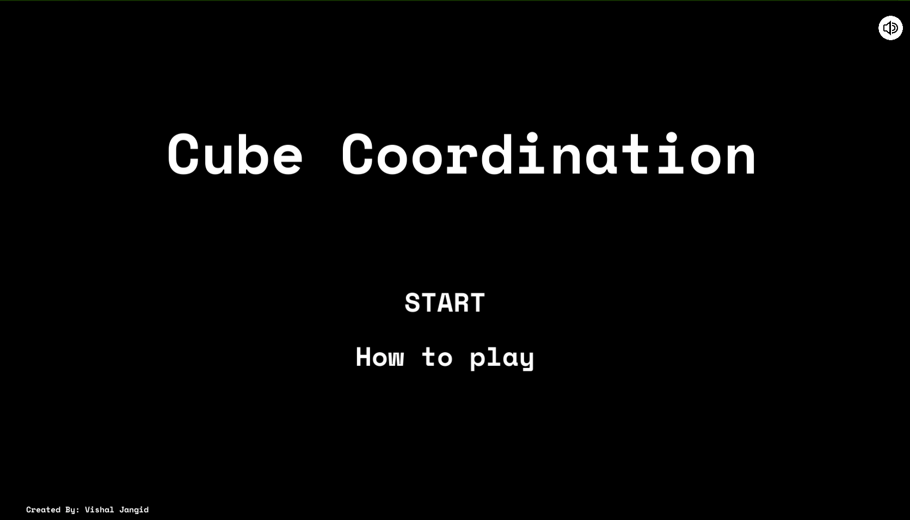
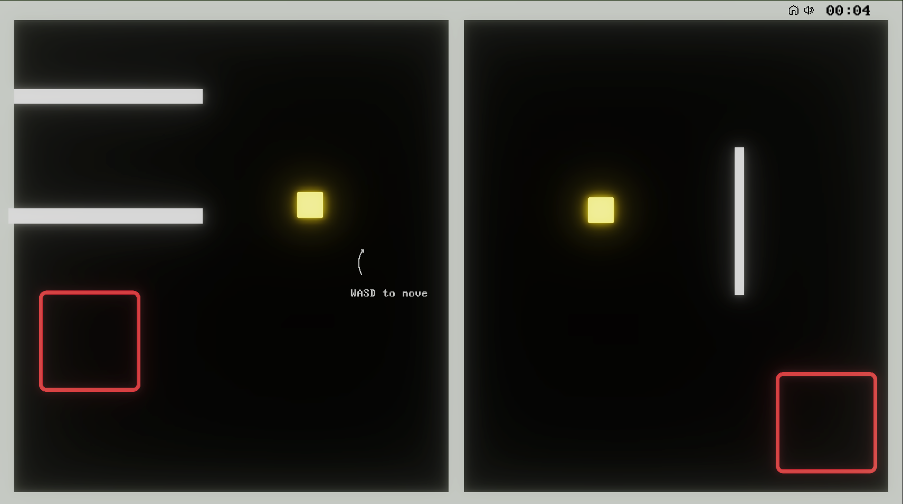
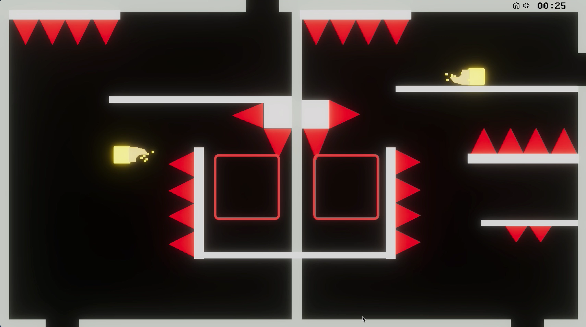
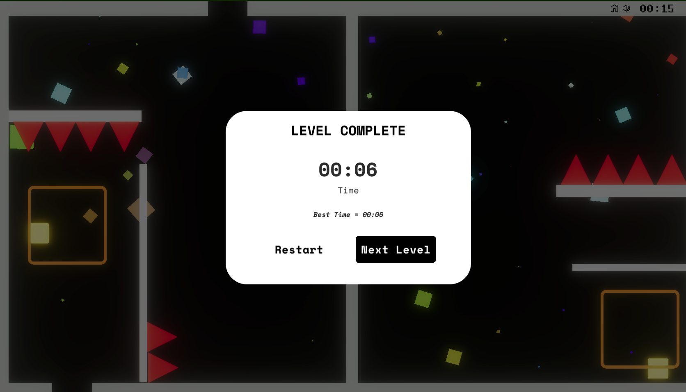

# Cube Coordination

Welcome to **Cube Coordination**, a 2D puzzle platformer game where players control two cubes simultaneously, each moving in the opposite direction. The goal is to navigate through challenging levels, solve puzzles, and reach the end platform together.

## Table of Contents

- [Screenshots](#screenshots)
- [Gameplay](#gameplay)
- [Features](#features)
- [Installation](#installation)
- [Controls](#controls)
- [Development](#development)
- [License](#license)

## Screenshots





## Gameplay

- **Dual Control:** Control both Cube A and Cube B simultaneously.
- **Platform Interaction:** Navigate different platform types such as spikes, portals etc. to reach winning area.
- **Winning Condition:** Both cubes must be on the Winning Platform simultaneously to win.


## Features

- **Dynamic Level Design:** Explore progressively challenging levels with various obstacles.
- **Minimalist UI:** Unobtrusive UI elements provide essential information.
- **Audio Integration:** Enjoy simple audio cues for cube movements and interactions.
- **Save** Saves the best time for each level and volume.

## Installation

1. Clone the repository:

   ```bash
   git clone https://github.com/VishalJangid123/cube-coordination.git
   ```
2. Open the project in Unity.
3. Run the game from the Unity Editor or build the project for your desired platform.

## Controls
* Arrow Keys/WASD: Move the active cube.

## Development
* Unity Version: Unity 2021.3.31f1.
* Scripting Language: C#


## License
This project is licensed under the MIT License.

   
